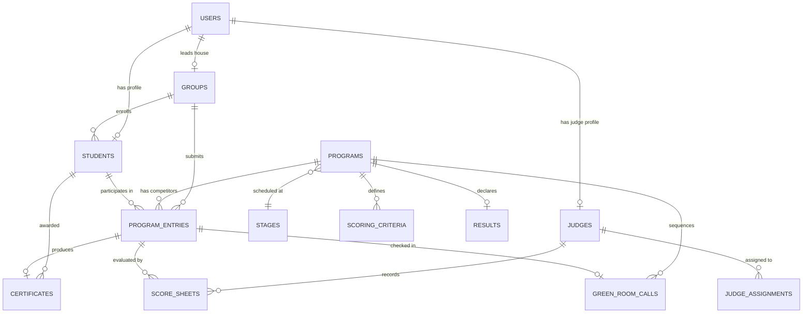

# QUAF Fest 09 — Database Architecture & Schema Reference
**Entity-Relationship Model, Table DDL, and Storage Constraints**

---

## 1. Entity-Relationship Diagram

---

## 2. Table Specifications

### 2.1 `users`
Core user identity and authentication credentials.
- `id` (BIGINT, PK, Auto-increment)
- `name` (VARCHAR 255)
- `email` (VARCHAR 255, UNIQUE)
- `password` (VARCHAR 255, Hashed)
- `role` (VARCHAR 50) — `super_admin`, `admin`, `judge`, `green_room_coordinator`, `group_leader`, `student`
- `phone` (VARCHAR 30, Nullable)
- `avatar_url` (VARCHAR 255, Nullable)
- `is_active` (BOOLEAN, Default: true)
- `timestamps`

---

### 2.2 `groups` (Academic Houses / Teams)
Competing student houses contesting the overall trophy.
- `id` (BIGINT, PK)
- `name` (VARCHAR 255) — e.g., "YUGO RUSHDIC", "CONCO MAJDIC"
- `code` (VARCHAR 20, UNIQUE) — e.g., "GRP-A", "GRP-B"
- `slug` (VARCHAR 255, UNIQUE)
- `logo_url` (VARCHAR 255, Nullable)
- `color_hex` (VARCHAR 10) — Official hex code (e.g. `#be1e2d`)
- `leader_id` (FK -> `users.id`, Nullable)
- `manager_name` (VARCHAR 255, Nullable)
- `manager_contact` (VARCHAR 50, Nullable)
- `points_cache` (UNSIGNED INT, Default: 0) — Denormalized aggregate points
- `rank_cache` (UNSIGNED INT, Default: 0) — Denormalized house rank
- `timestamps`

---

### 2.3 `students` (Competitor Master)
All registered student competitors.
- `id` (BIGINT, PK)
- `student_id` (VARCHAR 30, UNIQUE) — Official identifier (e.g., `QF1001`)
- `user_id` (FK -> `users.id`, Nullable)
- `group_id` (FK -> `groups.id`, Cascade on delete)
- `name` (VARCHAR 255)
- `category` (VARCHAR 30, Default: 'A Zone') — Zone designation: `A Zone`, `B Zone`, `C Zone`, `Mix Zone`
- `class_level` (VARCHAR 50, Nullable) — e.g., `TQS`, `S4`, `S3`, `S2`, `S1`
- `gender` (VARCHAR 10, Default: 'Male') — `Male`, `Female`
- `dob` (DATE, Nullable)
- `contact` (VARCHAR 30, Nullable)
- `photo_url` (VARCHAR 255, Nullable)
- `qr_token` (VARCHAR 64, UNIQUE) — Cryptographic verification token
- `points_cache` (UNSIGNED INT, Default: 0) — Accumulated personal points
- `timestamps`

---

### 2.4 `programs` (Competitions Master)
Festival events directory.
- `id` (BIGINT, PK)
- `name` (VARCHAR 255) — e.g., "Qira'ath", "Malayalam Speech"
- `malayalam_name` (VARCHAR 255, Nullable)
- `code` (VARCHAR 20, UNIQUE) — Official identifier: `Q9 - 101`
- `category_id` (FK -> `program_categories.id`)
- `type` (VARCHAR 20, Default: 'individual') — `individual`, `group`
- `participant_count` (UNSIGNED INT, Default: 2) — Max participants allowed per team
- `is_stage` (BOOLEAN, Default: true) — `true` (Stage), `false` (Non-stage)
- `gender_restriction` (VARCHAR 10, Default: 'all') — `all`, `male`, `female`
- `eligibility` (VARCHAR 50, Default: 'A Zone') — Zone restriction: `A Zone`, `B Zone`, `C Zone`, `Mix Zone`
- `rules` (TEXT, Nullable)
- `duration_minutes` (UNSIGNED INT, Default: 15)
- `stage_id` (FK -> `stages.id`, Nullable)
- `scheduled_time` (DATETIME, Nullable)
- `points_weight` (DECIMAL 4,2, Default: 5.00) — Event weight
- `status` (VARCHAR 20, Default: 'upcoming') — `upcoming`, `in_progress`, `completed`, `cancelled`
- `timestamps`

---

### 2.5 `program_entries` (Contestant Registrations)
Bridge table linking students to programs.
- `id` (BIGINT, PK)
- `program_id` (FK -> `programs.id`, Cascade on delete)
- `student_id` (FK -> `students.id`, Nullable)
- `group_id` (FK -> `groups.id`, Cascade on delete)
- `chest_number` (VARCHAR 20) — Student chest number for this entry
- `code_letter` (VARCHAR 10, Nullable) — Anonymized jury letter (e.g. `A`, `B`, `C`)
- `attendance_status` (VARCHAR 20, Default: 'waiting') — `waiting`, `present`, `absent`
- `status` (VARCHAR 20, Default: 'pending') — `pending`, `verified`, `rejected`
- `conflict_flag` (BOOLEAN, Default: false)
- `notes` (TEXT, Nullable)
- `timestamps`
- **Constraint**: `UNIQUE(program_id, chest_number)`

---

### 2.6 `stages` (Festival Venues)
Physical stage and venue definitions.
- `id` (BIGINT, PK)
- `name` (VARCHAR 255) — e.g., "Main Stage", "Stage 2"
- `code` (VARCHAR 20, UNIQUE) — e.g., "STG01"
- `location` (VARCHAR 255, Nullable)
- `capacity` (UNSIGNED INT, Default: 100)
- `current_program_id` (BIGINT, Nullable)
- `next_program_id` (BIGINT, Nullable)
- `status` (VARCHAR 20, Default: 'active') — `active`, `break`, `closed`
- `timestamps`

---

### 2.7 `scoring_criteria`
Criteria breakdown for each program.
- `id` (BIGINT, PK)
- `program_id` (FK -> `programs.id`, Cascade on delete)
- `criterion_name` (VARCHAR 255) — e.g. "Pronunciation", "Theme"
- `max_marks` (UNSIGNED INT, Default: 25)
- `timestamps`

---

### 2.8 `score_sheets`
Individual judge marks per contestant entry.
- `id` (BIGINT, PK)
- `judge_id` (FK -> `judges.id`, Cascade on delete)
- `program_id` (FK -> `programs.id`, Cascade on delete)
- `entry_id` (FK -> `program_entries.id`, Cascade on delete)
- `criteria_scores` (JSON, Nullable) — `{ "Pronunciation": 22, "Content": 24 }`
- `total_score` (DECIMAL 5,2, Default: 0.00)
- `remarks` (TEXT, Nullable)
- `is_submitted` (BOOLEAN, Default: false)
- `submitted_at` (DATETIME, Nullable)
- `timestamps`
- **Constraint**: `UNIQUE(judge_id, program_id, entry_id)`

---

### 2.9 `results`
Official verified verdict per competition.
- `id` (BIGINT, PK)
- `program_id` (FK -> `programs.id`, UNIQUE)
- `first_entry_id` (FK -> `program_entries.id`, Nullable)
- `second_entry_id` (FK -> `program_entries.id`, Nullable)
- `third_entry_id` (FK -> `program_entries.id`, Nullable)
- `status` (VARCHAR 20, Default: 'draft') — `draft`, `submitted`, `under_review`, `verified`, `published`
- `verified_by` (FK -> `users.id`, Nullable)
- `published_at` (DATETIME, Nullable)
- `remarks` (TEXT, Nullable)
- `timestamps`

---

### 2.10 `certificates`
Cryptographically verifiable credentials.
- `id` (BIGINT, PK)
- `certificate_number` (VARCHAR 50, UNIQUE) — e.g. `QUAF9-CERT-10023`
- `entry_id` (FK -> `program_entries.id`, Cascade on delete)
- `student_id` (FK -> `students.id`, Cascade on delete)
- `program_id` (FK -> `programs.id`, Cascade on delete)
- `position` (VARCHAR 30) — `1st Place`, `2nd Place`, `3rd Place`, `Participation`
- `issued_at` (DATETIME)
- `qr_verification_url` (VARCHAR 255, Nullable)
- `timestamps`

---

### 2.11 `audit_logs`
Administrative immutable event trail.
- `id` (BIGINT, PK)
- `user_id` (FK -> `users.id`, Nullable)
- `action` (VARCHAR 255)
- `model_type` (VARCHAR 255, Nullable)
- `model_id` (BIGINT, Nullable)
- `old_values` (JSON, Nullable)
- `new_values` (JSON, Nullable)
- `ip_address` (VARCHAR 45, Nullable)
- `user_agent` (TEXT, Nullable)
- `timestamps`
