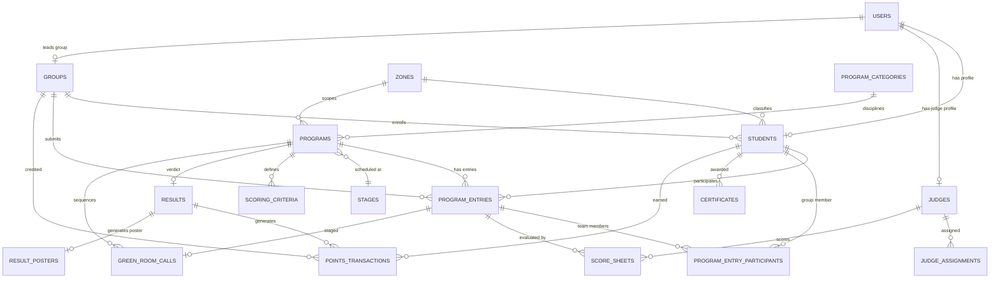

# QUAF Fest 09 — Database Architecture & Schema Reference
**Entity-Relationship Model, Table DDL, and Storage Constraints**

---

## 1. Entity-Relationship Diagram

---

## 2. Table Specifications

### 2.1 `users`
System credentials, user identity, and panel authorization.
- `id` (BIGINT, PK, Auto-increment)
- `name` (VARCHAR 255)
- `email` (VARCHAR 255, UNIQUE)
- `password` (VARCHAR 255, Hashed)
- `plain_password` (VARCHAR 255, Nullable) — Administrative reference password
- `role` (VARCHAR 50) — `super_admin`, `admin`, `judge`, `group_leader`, `green_room_coordinator`, `program_committee`, `announcer`, `media`, `student`
- `phone` (VARCHAR 30, Nullable)
- `avatar_url` (VARCHAR 255, Nullable)
- `is_active` (BOOLEAN, Default: true)
- `timestamps`

---

### 2.2 `groups` (Academic Groups / Teams)
The 5 official academic houses contesting the overall festival trophy.
- `id` (BIGINT, PK)
- `name` (VARCHAR 255) — e.g. "Pacto Hikmic", "Yugo Rushdic", "Conco Majdic", "Lumo Fikric", "Unio Hilmic"
- `code` (VARCHAR 20, UNIQUE) — `PACTO`, `YUGO`, `CONCO`, `LUMO`, `UNIO`
- `slug` (VARCHAR 255, UNIQUE)
- `logo_url` (VARCHAR 255, Nullable)
- `color_hex` (VARCHAR 10) — Official hex code: `#2E3192`, `#AD1E56`, `#F8E709`, `#56286B`, `#7F1518`
- `leader_id` (FK -> `users.id`, Nullable)
- `manager_name` (VARCHAR 255, Nullable)
- `assistant_managers` (JSON, Nullable)
- `admin_password` (VARCHAR 255, Nullable)
- `name_in_results` (VARCHAR 255, Nullable)
- `name_in_certificates` (VARCHAR 255, Nullable)
- `points_cache` (INTEGER, Default: 0) — Denormalized aggregate points
- `rank_cache` (INTEGER, Default: 0) — Current leaderboard standing
- `timestamps`

---

### 2.3 `zones`
Official festival academic divisions.
- `id` (BIGINT, PK)
- `name` (VARCHAR 100, UNIQUE) — `A Zone`, `B Zone`, `C Zone`, `Mix Zone`
- `malayalam_name` (VARCHAR 255, Nullable)
- `code` (VARCHAR 20, UNIQUE) — `A_ZONE`, `B_ZONE`, `C_ZONE`, `MIX_ZONE`
- `slug` (VARCHAR 100, UNIQUE)
- `order` (INTEGER, Default: 0)
- `color_hex` (VARCHAR 20, Nullable)
- `description` (TEXT, Nullable)
- `timestamps`

---

### 2.4 `students` (Competitor Master)
All 1,168 verified student competitors.
- `id` (BIGINT, PK)
- `student_id` (VARCHAR 30, UNIQUE) — Standardized chest number identifier (e.g., `1001`, `2001`)
- `user_id` (FK -> `users.id`, Nullable)
- `group_id` (FK -> `groups.id`, Cascade on delete)
- `zone_id` (FK -> `zones.id`, Nullable)
- `name` (VARCHAR 255)
- `category` (VARCHAR 30, Default: 'A Zone') — Zone designation
- `class_level` (VARCHAR 50, Nullable) — e.g. `NF4`, `S4`, `S3`, `S2`, `S1`, `TQS`
- `gender` (VARCHAR 10, Default: 'Male') — `Male`, `Female`
- `dob` (DATE, Nullable)
- `contact` (VARCHAR 30, Nullable)
- `photo_url` (VARCHAR 255, Nullable)
- `qr_token` (VARCHAR 64, UNIQUE) — Cryptographic verification token
- `points_cache` (INTEGER, Default: 0) — Accumulated personal points
- `timestamps`

---

### 2.5 `program_categories`
Competition disciplines.
- `id` (BIGINT, PK)
- `name` (VARCHAR 255) — e.g. "Elocution & Oratory", "Vocal Arts", "Fine Arts", "Literature"
- `slug` (VARCHAR 255, UNIQUE)
- `description` (TEXT, Nullable)
- `icon` (VARCHAR 50, Nullable)
- `timestamps`

---

### 2.6 `programs` (Competitions Master)
Directory of all 144 official conclave programs.
- `id` (BIGINT, PK)
- `name` (VARCHAR 255) — e.g. "Qira'ath", "Malayalam Speech"
- `malayalam_name` (VARCHAR 255, Nullable)
- `code` (VARCHAR 20, UNIQUE) — Official identifier: `Q9 - 101`
- `zone_id` (FK -> `zones.id`, Nullable)
- `category_id` (FK -> `program_categories.id`, Nullable)
- `type` (VARCHAR 20, Default: 'individual') — `individual`, `group`
- `participant_count` (INTEGER, Default: 2) — Max participants per team
- `max_participants` (INTEGER, Nullable)
- `max_participants_per_group` (INTEGER, Nullable)
- `individual_limit_counted` (BOOLEAN, Default: true) — Whether program counts towards the 5-program individual cap
- `mix_zone_open_to_all` (BOOLEAN, Default: true)
- `is_stage` (BOOLEAN, Default: true) — `true` (Stage program), `false` (Off-stage program)
- `gender_restriction` (VARCHAR 10, Default: 'all') — `all`, `male`, `female`
- `eligibility` (VARCHAR 50, Default: 'A Zone') — Zone restriction
- `eligibility_rules` (JSON, Nullable)
- `rules` (TEXT, Nullable) — Detailed guidelines and instructions
- `duration_minutes` (INTEGER, Default: 10)
- `stage_id` (FK -> `stages.id`, Nullable)
- `scheduled_time` (DATETIME, Nullable)
- `points_weight` (DECIMAL(5,2), Default: 1.00)
- `status` (VARCHAR 20, Default: 'upcoming') — `upcoming`, `in_progress`, `completed`, `cancelled`
- `timestamps`

---

### 2.7 `stages` (Venues)
Festival venues and physical stages.
- `id` (BIGINT, PK)
- `name` (VARCHAR 255) — e.g. "Stage 01 — Grand Amphitheatre"
- `code` (VARCHAR 20, UNIQUE) — `STG-01`, `STG-02`
- `location` (VARCHAR 255, Nullable)
- `capacity` (INTEGER, Default: 500)
- `current_program_id` (FK -> `programs.id`, Nullable)
- `next_program_id` (FK -> `programs.id`, Nullable)
- `status` (VARCHAR 20, Default: 'active') — `active`, `break`, `closed`
- `timestamps`

---

### 2.8 `program_entries` (Registrations Bridge)
Enrolled competitors in programs.
- `id` (BIGINT, PK)
- `program_id` (FK -> `programs.id`, Cascade on delete)
- `student_id` (FK -> `students.id`, Cascade on delete, Nullable for group entries)
- `group_id` (FK -> `groups.id`, Cascade on delete)
- `chest_number` (VARCHAR 30, Nullable)
- `code_letter` (VARCHAR 10, Nullable) — Secret anonymized stage identifier (`A`, `B`, `C`...)
- `status` (VARCHAR 20, Default: 'registered') — `registered`, `present`, `completed`, `absent`, `disqualified`
- `registered_by` (FK -> `users.id`, Nullable)
- `verified_by` (FK -> `users.id`, Nullable)
- `verified_at` (DATETIME, Nullable)
- `notes` (TEXT, Nullable)
- `timestamps`

---

### 2.9 `program_entry_participants`
Pivot table for multi-participant group programs.
- `id` (BIGINT, PK)
- `program_entry_id` (FK -> `program_entries.id`, Cascade on delete)
- `student_id` (FK -> `students.id`, Cascade on delete)
- `timestamps`

---

### 2.10 `judges` & `judge_assignments`
Jury members and event assignments.
- `judges`: `id`, `user_id`, `name`, `designation`, `specialization`, `contact`, `pin` (4-digit quick login), `bio`, `timestamps`
- `judge_assignments`: `id`, `judge_id`, `program_id`, `status` (`assigned`, `active`, `completed`), `timestamps`

---

### 2.11 `scoring_criteria` & `score_sheets`
Multi-criteria evaluation sheets.
- `scoring_criteria`: `id`, `program_id`, `criterion_name`, `max_marks` (INTEGER), `display_order`, `timestamps`
- `score_sheets`: `id`, `judge_id`, `program_entry_id`, `program_id`, `criteria_scores` (JSON), `raw_score` (DECIMAL), `percentage` (DECIMAL), `grade` (`A+`, `A`, `B+`, `B`, `C`), `is_locked` (BOOLEAN), `remarks` (TEXT), `timestamps`

---

### 2.12 `results` (Official Verdicts)
Competition verdicts and rankings.
- `id` (BIGINT, PK)
- `program_id` (FK -> `programs.id`, UNIQUE)
- `first_entry_id` (FK -> `program_entries.id`, Nullable)
- `second_entry_id` (FK -> `program_entries.id`, Nullable)
- `third_entry_id` (FK -> `program_entries.id`, Nullable)
- `first_points` (INTEGER, Default: 5)
- `second_points` (INTEGER, Default: 3)
- `third_points` (INTEGER, Default: 1)
- `status` (VARCHAR 20, Default: 'draft') — `draft`, `declared`, `published`
- `declared_by` (FK -> `users.id`, Nullable)
- `declared_at` (DATETIME, Nullable)
- `published_by` (FK -> `users.id`, Nullable)
- `published_at` (DATETIME, Nullable)
- `rankings_payload` (JSON, Nullable) — Dense ranking payload with ties
- `timestamps`

---

### 2.13 `points_transactions` (Auditable Ledger)
Immutable audit ledger for all points.
- `id` (BIGINT, PK)
- `group_id` (FK -> `groups.id`, Cascade on delete)
- `student_id` (FK -> `students.id`, Nullable)
- `program_id` (FK -> `programs.id`, Nullable)
- `result_id` (FK -> `results.id`, Nullable)
- `source_type` (VARCHAR 30) — `POSITION`, `GRADE`, `MANUAL_ADJUSTMENT`
- `points` (INTEGER) — Positive or negative adjustment
- `description` (VARCHAR 255)
- `timestamps`

---

### 2.14 `green_room_calls`
Stage call sequence and attendance tracking.
- `id` (BIGINT, PK)
- `program_id` (FK -> `programs.id`)
- `entry_id` (FK -> `program_entries.id`)
- `call_order` (INTEGER, Default: 1)
- `status` (VARCHAR 20, Default: 'pending') — `pending`, `called`, `ready`, `on_stage`, `completed`, `absent`
- `called_at`, `ready_at`, `on_stage_at` (DATETIMEs)
- `timestamps`

---

### 2.15 `certificates`
Cryptographically verifiable certificate records.
- `id` (BIGINT, PK)
- `student_id` (FK -> `students.id`)
- `program_id` (FK -> `programs.id`)
- `entry_id` (FK -> `program_entries.id`)
- `certificate_number` (VARCHAR 50, UNIQUE) — e.g. `CERT-Q9-2026-00142`
- `type` (VARCHAR 20) — `merit`, `participation`
- `position` (INTEGER, Nullable) — 1, 2, 3
- `grade` (VARCHAR 5, Nullable) — `A+`, `A`, `B+`, `B`, `C`
- `qr_token` (VARCHAR 64, UNIQUE)
- `issued_at` (DATETIME)
- `timestamps`

---

### 2.16 `media_*` & `result_posters`
Media Hub and Result Poster Studio tables.
- `result_posters`: `id`, `result_id`, `poster_image_path`, `headline`, `caption`, `template_name`, `settings_json`, `is_published`, `timestamps`
- `media_news`: `id`, `title`, `slug`, `category`, `excerpt`, `content`, `image_url`, `is_featured`, `published_at`, `timestamps`
- `media_galleries`: `id`, `title`, `category`, `image_url`, `caption`, `timestamps`
- `media_videos`: `id`, `title`, `youtube_url`, `is_live`, `timestamps`
- `media_templates`: `id`, `name`, `type`, `layout_config`, `is_active`, `timestamps`

---

### 2.17 `audit_logs`
System security and action logs.
- `id` (BIGINT, PK)
- `user_id` (FK -> `users.id`, Nullable)
- `action` (VARCHAR 100) — e.g. `declare_result`, `create_stage`, `sync_festival_data`
- `model_type` (VARCHAR 100, Nullable)
- `model_id` (BIGINT, Nullable)
- `old_values` (JSON, Nullable)
- `new_values` (JSON, Nullable)
- `ip_address` (VARCHAR 45, Nullable)
- `user_agent` (TEXT, Nullable)
- `timestamps`
