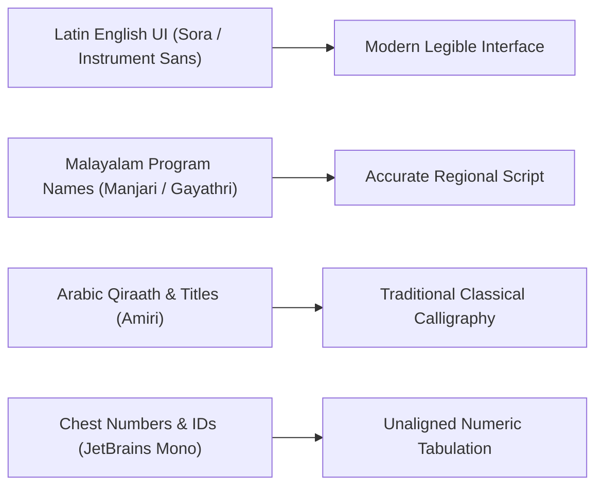

# QUAF Fest 09 — Design System & UI Specifications
**Brand Tokens, Color Palette, Typography, and UI Components**

---

## 1. Color Palette Tokens

The QUAF Fest visual identity relies on an authoritative, festive, and high-contrast color scheme:

| Color Name | Hex Token | Tailwind Class | Application / Usage |
|---|---|---|---|
| **Crimson Red** | `#be1e2d` | `bg-[#be1e2d]`, `text-[#be1e2d]` | Primary brand accent, primary CTA buttons, active sidebar highlights, emergency alerts |
| **Festival Gold** | `#f3bd2e` | `bg-[#f3bd2e]`, `text-[#f3bd2e]` | 1st place podium medals, section category tags, star badges, accent highlights |
| **Ocean Blue** | `#005c94` | `bg-[#005c94]`, `text-[#005c94]` | House C branding, informational pills, academic house metadata |
| **Emerald Green** | `#009444` | `bg-[#009444]`, `text-[#009444]` | Live stage status, active participant indicators, verified marks |
| **Dark Neutral** | `#0d0f11` | `bg-[#0d0f11]` | Admin sidebar background, dark drawers, elevated contrast shells |
| **Slate Gray** | `#64748b` | `text-slate-500` | Secondary metadata, descriptions, subtle table borders |
| **Pure White** | `#ffffff` | `bg-white` | Elevated card surfaces, inputs, light layouts |

---

## 2. Typography Rules

QUAF 09 supports a multi-script typographic hierarchy:



- **English UI Body & Headings**: `Sora`, `Instrument Sans` (Clean, modern geometry).
- **Malayalam Program & Student Names**: `Manjari` (700 bold), `Gayathri` (high clarity for Malayalam ligatures).
- **Arabic Inscriptions**: `Amiri` (traditional Naskh typography).
- **Codes & Chest Numbers**: `JetBrains Mono` (Zero ambiguity between `0` and `O`, `1` and `I`).

---

## 3. UI Component Patterns

### 3.1 Primary Buttons
```html
<!-- Primary Brand Action -->
<button class="px-4 py-2.5 rounded-xl bg-[#be1e2d] hover:bg-[#a01624] text-white font-bold text-xs uppercase tracking-wider transition-all shadow-md">
    Button Label
</button>
```

### 3.2 Podium / Placement Badges
- **1st Place**: `<span class="bg-[#f3bd2e] text-white font-bold px-2 py-0.5 rounded-full">1st</span>`
- **2nd Place**: `<span class="bg-slate-400 text-white font-bold px-2 py-0.5 rounded-full">2nd</span>`
- **3rd Place**: `<span class="bg-amber-700 text-white font-bold px-2 py-0.5 rounded-full">3rd</span>`

### 3.3 Stage Live Status Pills
- **Active / Live Now**: `<span class="bg-emerald-50 text-emerald-700 border border-emerald-200 font-bold px-2 py-0.5 rounded text-[10px] uppercase font-mono">LIVE NOW</span>`
- **Intermission / Break**: `<span class="bg-amber-50 text-amber-700 border border-amber-200 font-bold px-2 py-0.5 rounded text-[10px] uppercase font-mono">BREAK</span>`
- **Closed**: `<span class="bg-slate-100 text-slate-600 font-bold px-2 py-0.5 rounded text-[10px] uppercase font-mono">CLOSED</span>`
