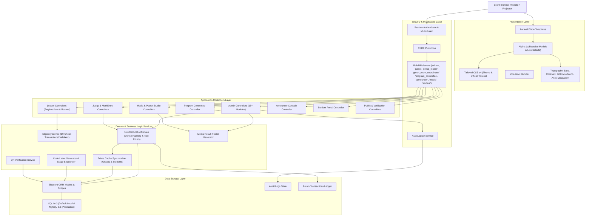

# QUAF Fest 09 — System Architecture
**Technical Architecture, Data Flows, and Calculation Engines**

---

## 1. Architectural Stack

---

## 2. Layer Descriptions

### 1. Presentation Layer (Server-Rendered Reactive UI)
- **Blade Templating**: High-speed, maintainable server-rendered views with strict layout inheritance:
  - `layouts.admin`: Central administration shell with sliding settings drawer and audit widgets.
  - `layouts.public`: Mobile-first responsive public festival portal.
  - `layouts.leader`: Academic group leader console with quota tracking.
  - `layouts.judge`: Touch-friendly digital judging scorecard.
  - `layouts.program-committee`: Rules and Niyamavali management workspace.
  - `layouts.media`: Press releases, media galleries, and poster studio.
  - `layouts.student`: Student competitor profile, schedule, and certificates.
- **Multilingual Typography Architecture**:
  - **Sora**: Primary UI font for labels, buttons, navigation, body copy, and subtitles.
  - **Rockwell**: Display serif font for brand headers and section banners.
  - **JetBrains Mono**: Tabular monospace font for numbers, chest numbers, scores, rankings, codes, and timers.
  - **Anek Malayalam**: Dedicated typography strictly for Malayalam script (rules, criteria, names, and news dispatches), preventing Latin alphabet font corruption.
- **Alpine.js**: Declarative micro-reactivity for live filters, modals, multi-student slot selectors, and canvas graphics rendering.
- **Tailwind CSS v4**: Theme engine utilizing custom CSS variables matching official 2026 group and festival brand specifications.

### 2. Security & Routing Layer
- **Multi-Role Middleware (`app/Http/Middleware/RoleMiddleware.php`)**: Gatekeeper enforcing access control across 8 user roles: `super_admin`, `admin`, `judge`, `green_room_coordinator`, `group_leader`, `program_committee`, `announcer`, `media`, and `student`.
- **Graceful Redirection**: Unauthorized attempts to access role-specific panels redirect users directly to their appropriate dashboard instead of throwing generic 403 errors.
- **CSRF Token Validation**: Enforced across all state-mutating requests (`POST`, `PUT`, `PATCH`, `DELETE`).

### 3. Business Logic & Calculation Engines

#### Points Calculation Pipeline (`App\Services\PointCalculationService`)
When a competition result is declared or published via `ResultController`:
1. First, second, and third place podium placements are extracted from verified marksheets.
2. **Dense Ranking with Ties**:
   - Tied contestants receive the full points corresponding to their tied rank.
   - Example: A tie for 1st place awards 5 points to both contestants; the next distinct score receives 3 points (2nd place).
3. **Handbook Scoring Weights**:
   - **1st Position**: **5 points**
   - **2nd Position**: **3 points**
   - **3rd Position**: **1 point**
4. **Grade Points Engine**:
   - **Grade A+** (90–100%): **6 points**
   - **Grade A** (70–89%): **5 points**
   - **Grade B+** (Explicitly designated): **4 points**
   - **Grade B** (60–69%): **3 points**
   - **Grade C** (50–59%): **1 point**
5. **Group Programme Single-Award Rule**:
   - Points are credited once to the Group; individual student members do not receive duplicate individual points.
6. **Auditable Transaction Ledger (`points_transactions`)**:
   - Every point awarded is logged with `group_id`, `program_id`, `result_id`, `student_id`, `source_type` (`POSITION`, `GRADE`), and calculation description.
7. **Cache Invalidation & Denormalized Updates**:
   - `students.points_cache` increments immediately.
   - `groups.points_cache` recalculates aggregate group points.
   - `groups.rank_cache` persists current group standings for instant sub-millisecond public queries.

#### The 10-Check Eligibility Engine (`App\Services\EligibilityService`)
Executes transactional checks before any student is enrolled in a program:
1. Student active status check.
2. Group assignment check.
3. Program open state check.
4. Zone matching check (student zone matches program zone, or program is Mix Zone).
5. Individual 5-programme quota cap check (rejects 6th individual event).
6. Group event exclusion check (group events do not decrement individual quota).
7. Gender restriction check (Male / Female / All).
8. Group team participant limit check (e.g. maximum 2 participants per group).
9. Duplicate registration prevention check.
10. Deadline cutoff verification check.

---

## 3. Data Storage & Schema Design
- **SQLite 3 (Default Local)**: Zero-configuration local database persisted at `database/database.sqlite`.
- **MySQL 8.0 / MariaDB (Production Compatible)**: Configurable via `.env` for production deployments.
- **Optimized Composite Indexes**: Added for high-frequency queries on `program_entries(program_id, group_id)`, `students(group_id, category)`, `programs(zone_id, is_stage)`, and `points_transactions(group_id, source_type)`.
