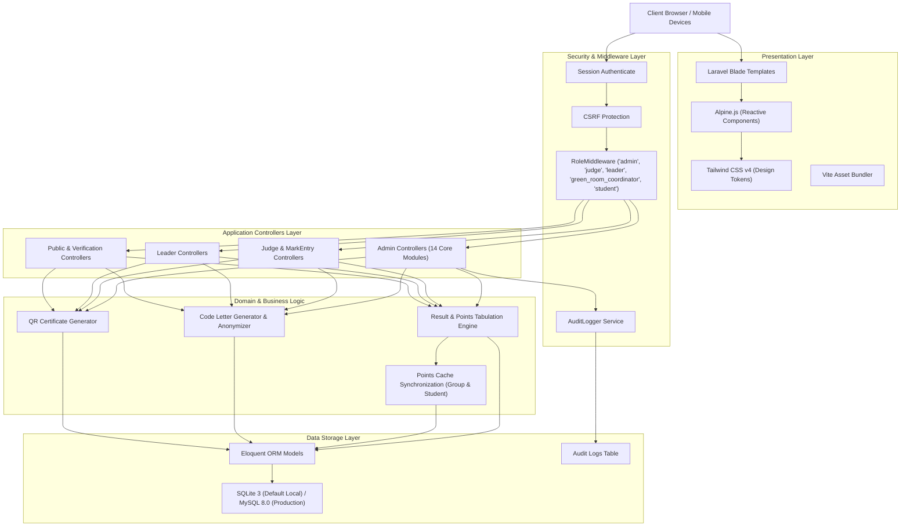

# QUAF Fest 09 — System Architecture
**Technical Architecture, Data Flows, and Calculation Engines**

---

## 1. Architectural Stack

---

## 2. Layer Descriptions

### 1. Presentation Layer (Lightweight Server-Rendered UI)
- **Blade Templating**: Fast, highly maintainable, server-rendered views with layout inheritance (`layouts.admin`, `layouts.public`, `layouts.leader`, `layouts.judge`, `layouts.student`).
- **Alpine.js**: Declarative client-side micro-reactivity for modal dialogs, drawer menus, live filters, and collapsible sidebars without the complexity of heavy SPA frameworks.
- **Tailwind CSS v4**: Utility-first CSS integrated with Vite for lightning-fast sub-second HMR and production minification.

### 2. Security & Routing Layer
- **Stateful Web Authentication**: Cookie-based session authentication with standard Laravel session guards.
- **RoleMiddleware (`app/Http/Middleware/RoleMiddleware.php`)**: Gatekeeper intercepting requests and enforcing role checks (`super_admin`, `admin`, `judge`, `green_room_coordinator`, `group_leader`, `student`).
- **CSRF Token Validation**: Enforced across all state-mutating requests (`POST`, `PUT`, `DELETE`).

### 3. Business Logic & Tabulation Engine

#### Points Calculation Pipeline
When a competition result is officially published via `AdminResultController@publish`:
1. First, second, and third place podium placements are extracted from the verified marksheet.
2. Official handbook weights are applied:
   - **1st Position**: **5 points**
   - **2nd Position**: **3 points**
   - **3rd Position**: **1 point**
3. Grade points are awarded based on performance marks:
   - **Grade A+** (90–100%): **6 points**
   - **Grade A** (70–89%): **5 points**
   - **Grade B** (60–69%): **3 points**
   - **Grade C** (50–59%): **1 point**
4. **Group Programme Single-Award Rule**:
   - Points are credited once to the Group; they are not multiplied per student on stage.
5. **Auditable Ledger (`points_transactions`)**:
   - Every point transaction is persisted in `points_transactions` with `group_id`, `program_id`, `result_id`, `source_type` (`POSITION`, `GRADE`), points, and calculation description.
6. **Cache Invalidation & Denormalized Updates**:
   - `students.points_cache` is updated for individual participants.
   - `groups.points_cache` is refreshed as the sum of all transactions for that Group.
   - `groups.rank_cache` is updated and persisted for instant 0-millisecond queries on public leaderboards.

#### The 10-Check Eligibility Engine (`App\Services\EligibilityService`)
1. Student active status check.
2. Group assignment check.
3. Programme open state check.
4. Zone matching check (A Zone, B Zone, C Zone) & Mix Zone permission check (`mix_zone_open_to_all`).
5. Max 5 individual programmes limit per student (atomic lock check).
6. Total programme participant limit (`max_participants`).
7. Group-wise participant cap (`max_participants_per_group`).
8. Duplicate registration prevention.
9. Required participant count for group programmes.
10. Gender & class restrictions.

#### Anonymization Pipeline (Fair Play)
1. In the Green Room, enrolled contestants are checked in.
2. An alphanumeric code letter (e.g., `A`, `B`, `C`, `D`) is pseudo-randomly assigned to each contestant for the program.
3. The jury receives digital scorecards displaying **only the Code Letter and Program ID**. Student names, chest numbers, and group affiliations are completely masked until verdict approval.

---

## 3. Database Concurrency & Integrity
- **SQLite Concurrency**: Configured with WAL mode (`journal_mode=WAL`) and `busy_timeout=5000` to prevent database locks during peak concurrent scoring.
- **Unique Constraint Safety**: Compound unique index on `program_entries(program_id, chest_number)` guarantees a student cannot be doubly enrolled in the same program under the same chest number.
- **Atomic Transactions**: Complex state transitions (declaring results, assigning marks, awarding group points) execute within `DB::transaction()` closures to maintain absolute consistency.

---

## 4. Audit Logging Architecture
- The system includes a dedicated `AuditLogger` service (`app/Services/AuditLogger.php`).
- Every administrative action (modifying marks, declaring results, editing student profiles, altering festival settings) records:
  - User ID and role
  - Action identifier
  - Target model and record ID
  - IP Address and User Agent
  - Pre-change and post-change JSON payload
