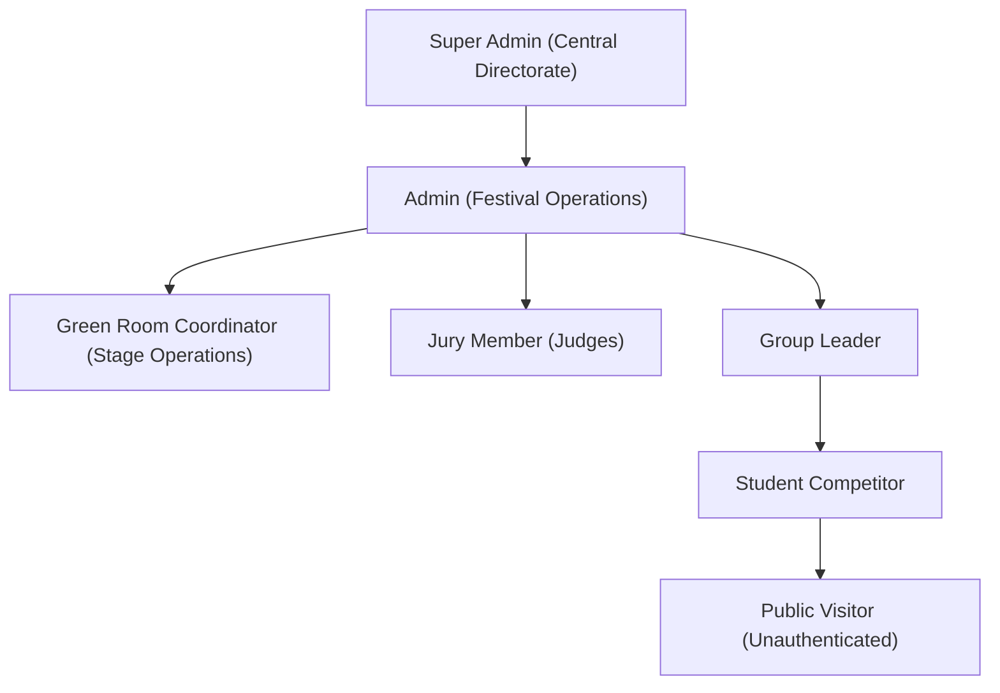

# QUAF Fest 09 — User Roles & Permissions Matrix
**Access Control, Authorization Policies, and Role Gateways**

---

## 1. Role Hierarchy



---

## 2. Role Permissions Matrix

| Feature / Action | Super Admin | Admin | Green Room | Judge | Group Leader | Student | Public |
|---|:---:|:---:|:---:|:---:|:---:|:---:|:---:|
| **View Public Homepage & Results** | Yes | Yes | Yes | Yes | Yes | Yes | Yes |
| **Verify Certificate QR** | Yes | Yes | Yes | Yes | Yes | Yes | Yes |
| **View Personal Student Profile** | Yes | Yes | No | No | Group Only | Own Only | No |
| **Register / Edit Group Students** | Yes | Yes | No | No | Group Only | No | No |
| **Enroll Students in Programs** | Yes | Yes | No | No | Group Only | No | No |
| **Manage Stage Call Lists** | Yes | Yes | Yes | No | No | No | No |
| **Assign / View Code Letters** | Yes | Yes | Yes | Code Only | No | No | No |
| **Submit Jury Scores** | Yes | Override | No | Assigned Only | No | No | No |
| **Verify & Declare Results** | Yes | Yes | No | No | No | No | No |
| **Publish Results & Update Points** | Yes | Yes | No | No | No | No | No |
| **Manage Official Groups** | Yes | Yes | No | No | No | No | No |
| **Manage Zones (`/admin/zones`)** | Yes | Yes | No | No | No | No | No |
| **Configure Programs & Limits** | Yes | Yes | No | No | No | No | No |
| **Configure Stages & Live Status** | Yes | Yes | Yes | No | No | No | No |
| **System Settings & Audit Logs** | Yes | Yes | No | No | No | No | No |
| **User Account Management** | Yes | View Only | No | No | No | No | No |

---

## 3. Role Specification & Portals

### 3.1 Super Admin (`super_admin`)
- **Portal**: `/admin`
- **Default Account**: `admin@quaf.fest`
- **Scope**: Absolute root authority across the entire platform. Can alter point weights, modify published results, inspect audit logs, broadcast emergency messages, and manage user accounts.

### 3.2 Admin (`admin`)
- **Portal**: `/admin`
- **Scope**: Central festival coordinators. Manages day-to-day operations: approving registrations, monitoring stages, handling judge mark sheets, declaring official results, and generating printable festival gazettes.

### 3.3 Green Room Coordinator (`green_room_coordinator`)
- **Portal**: `/greenroom`
- **Default Account**: `greenroom@quaf.fest`
- **Scope**: Field stage operations. Generates anonymized code letters for competitors, prepares printable stage call lists, verifies physical chest slips, and coordinates with venue stage managers.

### 3.4 Judge / Jury Member (`judge`)
- **Portal**: `/judge`
- **Default Account**: `judge1@quaf.fest`
- **Scope**: Evaluation of assigned competitions. Receives contestant code letters (names and houses masked), enters criteria scores, reviews averages, and locks digital marksheets upon completion.

### 3.5 House Leader / Captain (`group_leader`)
- **Portal**: `/leader`
- **Default Account**: `leader.groupa@quaf.fest`
- **Scope**: Representatives of the 4 Academic Houses (YUGO RUSHDIC, CONCO MAJDIC, LUMO FIKRIC, UNIO HILMIC). Manages house roster, registers competitors for eligible individual and group events within established quotas, and monitors house points.

### 3.6 Student Competitor (`student`)
- **Portal**: `/student`
- **Default Account**: `student@quaf.fest`
- **Scope**: Competitor dashboard. Displays chest number, QR token, enrolled events with schedule times and venue locations, earned individual points, and authentic certificate downloads.

### 3.7 Public Visitor
- **Portal**: `/`
- **Scope**: Unauthenticated access to the live festival portal, active stage statuses, public leaderboards, verified verdicts, news articles, photo gallery, and certificate verification.

---

## 4. Implementation Reference
Role enforcement is handled primarily by `App\Http\Middleware\RoleMiddleware`:
```php
Route::middleware(['auth', 'role:admin,super_admin'])->prefix('admin')->group(function () {
    // Admin routes
});

Route::middleware(['auth', 'role:judge'])->prefix('judge')->group(function () {
    // Judge routes
});

Route::middleware(['auth', 'role:group_leader'])->prefix('leader')->group(function () {
    // House leader routes
});

Route::middleware(['auth', 'role:green_room_coordinator'])->prefix('greenroom')->group(function () {
    // Green room routes
});
```
