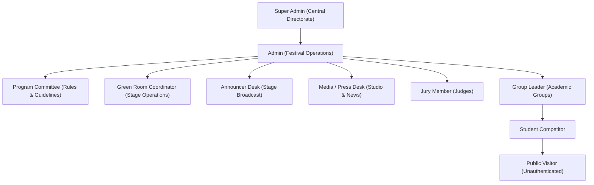

# QUAF Fest 09 — User Roles & Permissions Matrix
**Access Control, Authorization Policies, and Role Gateways**

---

## 1. Role Hierarchy



---

## 2. Role Permissions Matrix

| Feature / Capability | Super Admin | Admin | Program Committee | Green Room | Announcer | Media | Judge | Group Leader | Student | Public |
|---|:---:|:---:|:---:|:---:|:---:|:---:|:---:|:---:|:---:|:---:|
| **Public Portal & Results** | Yes | Yes | Yes | Yes | Yes | Yes | Yes | Yes | Yes | Yes |
| **QR Certificate / Student Verification** | Yes | Yes | Yes | Yes | Yes | Yes | Yes | Yes | Yes | Yes |
| **Manage Programs & Limits** | Yes | Yes | Yes | No | No | No | No | No | No | No |
| **Edit Program Rules & Niyamavali** | Yes | Yes | Full Control | No | No | No | No | No | No | No |
| **Register & Edit Students** | Yes | Yes | No | No | No | No | No | Group Only | No | No |
| **Enroll Students in Competitions** | Yes | Yes | No | No | No | No | No | Group Only | No | No |
| **Green Room Check-In & Code Letters** | Yes | Yes | No | Full Control | View Only | No | Code Only | No | No | No |
| **Auditorium Projector View** | Yes | Yes | Yes | Yes | Yes | Yes | Yes | Yes | No | Yes |
| **Announcer Call Sheet & Result Queue**| Yes | Yes | No | View Only | Full Control | View Only | No | No | No | No |
| **News, Gallery & Poster Studio** | Yes | Yes | No | No | No | Full Control | No | No | No | No |
| **Submit Digital Jury Scores** | Yes | Override | No | No | No | No | Assigned Only | No | No | No |
| **Declare & Publish Results** | Yes | Yes | No | No | No | No | No | No | No | No |
| **Undeclare / Rollback Results** | Yes | Yes | No | No | No | No | No | No | No | No |
| **1-Click Official Data Sync** | Yes | Yes | No | No | No | No | No | No | No | No |
| **System Settings & Audit Logs** | Yes | Yes | No | No | No | No | No | No | No | No |
| **Personal Profile & ID Card** | Yes | Yes | Yes | Yes | Yes | Yes | Yes | Yes | Own Only | No |

---

## 3. Role Specification & Portals

### 3.1 Super Admin (`super_admin`)
- **Access / Portal**: `/admin`
- **Dashboard**: Central Festival Operations Center.
- **Allowed Actions**: Complete root control across all modules: emergency broadcasts, system settings, database synchronization, marks override, results declaration, audit logs, and account management.
- **Restricted Actions**: None.
- **Authentication**: Standard session login with email and password (`/login`).

### 3.2 Admin (`admin`)
- **Access / Portal**: `/admin`
- **Dashboard**: Central Festival Operations Center.
- **Allowed Actions**: Program master configuration, bulk student enrollments, stage venue scheduling, marksheet verification, result declaration, point recalculation, and official exports.
- **Restricted Actions**: Modifying root environment files or overriding super-admin credentials.
- **Authentication**: Standard session login with email and password (`/login`).

### 3.3 Program Committee / Program Samithi (`program_committee`)
- **Access / Portal**: `/program-committee`
- **Dashboard**: Program Samithi Portal.
- **Allowed Actions**: Managing competition rules, duration, scoring criteria weights, Malayalam instructions, and generating the printable Niyamavali rulebook (`/program-committee/niyamavali/print-book`).
- **Restricted Actions**: Declaring competition results, altering group points, or modifying student rosters.
- **Authentication**: Standard session login with email and password (`/login`). Default: `samithi@quaf.fest`.

### 3.4 Group Leader / Team Captain (`group_leader`)
- **Access / Portal**: `/leader`
- **Dashboard**: Group Leader Panel.
- **Allowed Actions**: Managing group roster for their assigned group (Lumo, Pacto, Conco, Unio, Yugo), registering students with quota meter tracking (X/5 Used), continuous registration, and inline editing or replacement of enrolled students.
- **Restricted Actions**: Accessing or editing competitor entries of rival groups; viewing jury marks before official publication.
- **Authentication**: Standard session login (`/login`) with group leader email or shortcut handle.

### 3.5 Judge / Jury Member (`judge`)
- **Access / Portal**: `/judge`
- **Dashboard**: Digital Jury Evaluation Suite.
- **Allowed Actions**: Evaluating assigned competitions using anonymous contestant code letters, entering criteria scores, awarding grades (A+, A, B+, B, C), and locking submissions.
- **Restricted Actions**: Accessing student identities, chest numbers, or group affiliations during active judging.
- **Authentication**: Touch-friendly 4-digit PIN login (`/judge/login`) or standard login.

### 3.6 Green Room Coordinator (`green_room_coordinator`)
- **Access / Portal**: `/greenroom`
- **Dashboard**: Green Room Operations Slate.
- **Allowed Actions**: Marking competitor stage attendance, generating randomized code letters (`A`, `B`, `C`...), printing stage call lists, verifying physical chest slips, and advancing contestants to "on stage".
- **Restricted Actions**: Viewing or entering judge marks; declaring results.
- **Authentication**: Standard session login (`/login`). Default: `greenroom@quaf.fest`.

### 3.7 Announcer Desk (`announcer`)
- **Access / Portal**: `/announcer`
- **Dashboard**: Announcer Operations Console.
- **Allowed Actions**: Receiving declared results in real-time, announcing winners over the auditorium sound system, and viewing stage call sheets.
- **Restricted Actions**: Modifying marks, publishing results, or altering program schedules.
- **Authentication**: Standard session login (`/login`).

### 3.8 Media & Press Desk (`media`)
- **Access / Portal**: `/media`
- **Dashboard**: Media Operations Hub.
- **Allowed Actions**: Authoring festival news articles, uploading photo gallery items, managing video streams, and using the Result Poster Studio (`/media/results/{result}/studio`) to generate branded social media graphics.
- **Restricted Actions**: Entering judge marks or editing competition settings.
- **Authentication**: Standard session login (`/login`). Default: `media@quaf.fest`.

### 3.9 Student Competitor (`student`)
- **Access / Portal**: `/student`
- **Dashboard**: Student Competitor Portal.
- **Allowed Actions**: Viewing registered programs, stage venues, schedule times, quota status (X/5 Used), digital ID card (`/student/id-card`), and downloading authentic QR-coded certificates.
- **Restricted Actions**: Enrolling in events (handled by Group Leader); editing profile credentials.
- **Authentication**: Student login (`/student/login`) with Student ID / Chest Number and password.

### 3.10 Public Visitor (Unauthenticated)
- **Access / Portal**: `/`
- **Scope**: Unrestricted public access to the live festival portal, active stage statuses, public leaderboards, verified verdicts, news articles, photo gallery, video streams, and QR verification gateways.

---

## 4. Role Enforcement & Middleware
Role enforcement is handled by `App\Http\Middleware\RoleMiddleware`:
```php
// Central Administration
Route::middleware(['auth', 'role:admin,super_admin'])->prefix('admin')->group(...);

// Program Committee
Route::middleware(['auth', 'role:program_committee,admin,super_admin'])->prefix('program-committee')->group(...);

// Group Leaders
Route::middleware(['auth', 'role:group_leader'])->prefix('leader')->group(...);

// Judges
Route::middleware(['auth', 'role:judge'])->prefix('judge')->group(...);

// Green Room
Route::middleware(['auth', 'role:green_room_coordinator,admin,super_admin'])->prefix('greenroom')->group(...);

// Announcer
Route::middleware(['auth', 'role:announcer,admin,super_admin'])->prefix('announcer')->group(...);

// Media Desk
Route::middleware(['auth', 'role:media,admin,super_admin'])->prefix('media')->group(...);

// Students
Route::middleware(['auth', 'role:student'])->prefix('student')->group(...);
```
When a user attempts to access an unauthorized panel, `RoleMiddleware` redirects them gracefully to their authorized dashboard rather than throwing an access-restricted 403 error.
