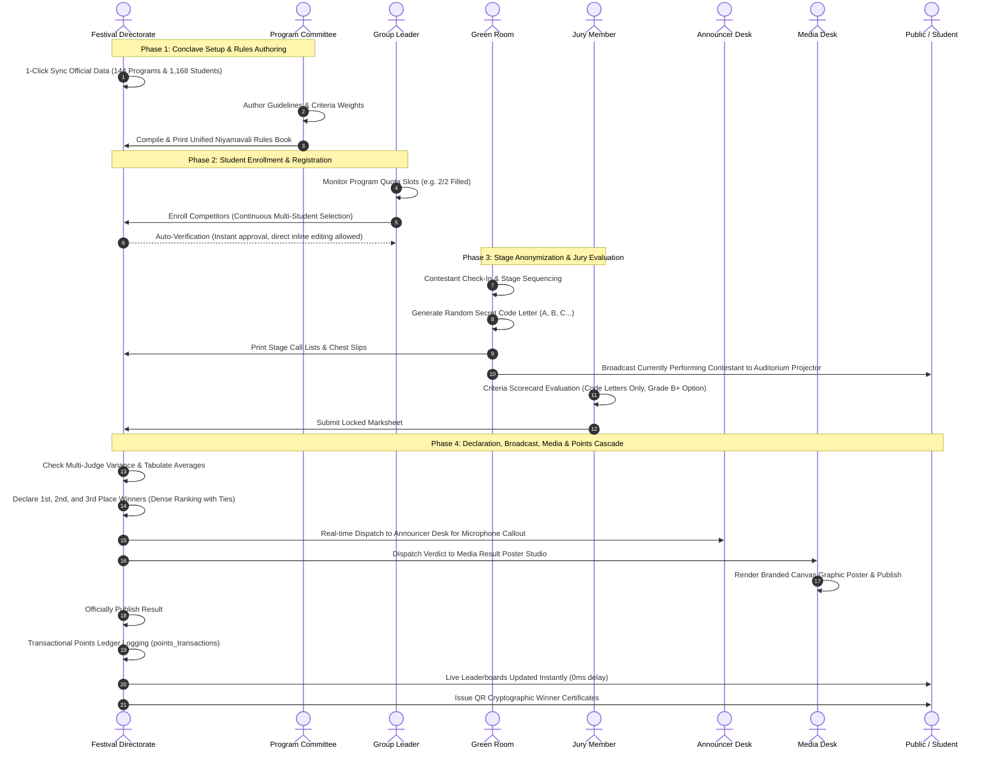

# QUAF Fest 09 — Festival Lifecycle & Operational Workflow
**End-to-End Operational Sequences from Setup to Grand Finale**

---

---

## Detailed Phase Breakdown

### Phase 1: Pre-Festival Preparations & Rules Authoring
1. **Official Data Synchronization**:
   - The Central Festival Directorate executes the 1-click sync command (`php artisan app:sync-official-programs` and `php artisan app:sync-official-students`) or clicks **Sync Official Data** on the Admin Dashboard.
   - 144 official programs and 1,168 students are safely ingested into the database without duplicating existing records.
2. **Academic Structure & Groups**:
   - 5 Academic Groups (Pacto Hikmic, Yugo Rushdic, Conco Majdic, Lumo Fikric, Unio Hilmic) are verified with designated manager contacts and official brand color hexes.
   - 4 Zones (`A Zone`, `B Zone`, `C Zone`, `Mix Zone`) are locked to eligible classes.
3. **Program Committee Guidelines Publication**:
   - The Program Committee (`/program-committee`) verifies Malayalam guidelines, duration limits, and scoring criteria weights.
   - The Committee generates the complete, printable Niyamavali Rulebook (`/program-committee/niyamavali/print-book`) with cover page, table of contents, and program guidelines.

---

### Phase 2: Registration & Quota Management
1. **Quota Slot Monitoring**:
   - Group leaders log in to `/leader` and inspect each competition's capacity indicators (e.g. `2 / 2 Slots Filled` or `1 / 2 Slots Filled - Partial`).
2. **Continuous Multi-Student Registration**:
   - Group leaders select eligible students from their group roster. The 10-check `EligibilityService` verifies zone compatibility and prevents students from exceeding the 5-program individual cap.
   - Group events do not decrement the individual 5-program cap.
3. **Auto-Verification**:
   - Registrations are automatically marked verified upon submission, removing administrative bottlenecks. Group leaders retain the ability to edit or replace enrolled students inline (`/leader/registrations/{entry}/edit`) until registration cutoff deadlines.

---

### Phase 3: Stage Operations & Jury Evaluation
1. **Green Room Check-In**:
   - Contestants report to the Green Room. Attendance is logged on digital call lists.
2. **Secret Code-Letter Generation**:
   - The Green Room Coordinator generates random code letters (`A`, `B`, `C`, `D`...) per program. Competitor identities, chest numbers, and group affiliations are completely masked.
3. **Stage Sequencing & Chest Slips**:
   - Printable Stage Call Lists and verified chest slips are handed to stage managers.
4. **Auditorium Projector Display (`/stages/{stage}/projector`)**:
   - High-contrast projector displays indicate the active stage name, currently performing contestant/code letter, and upcoming contestants on big auditorium screens.
5. **Touch-Screen Jury Scoring**:
   - Judges log in using quick 4-digit PINs at `/judge/login`.
   - Judges enter numeric marks across established scoring criteria and select performance grades (A+, A, B+, B, C).
   - Once submitted, scorecards are locked against tampering.

---

### Phase 4: Results Declaration, Broadcasting & Points Cascade
1. **Mark Verification & Tabulation**:
   - Admin reviews submitted mark sheets on `/admin/mark-entry/check` to detect judge score variance.
2. **Result Declaration (Dense Ranking Engine)**:
   - Admin confirms 1st, 2nd, and 3rd place winners.
   - **Dense Ranking with Ties**: Tied contestants receive full points for their shared rank (e.g. joint 1st place awards 5 points to both contestants; the next distinct score receives 3 points).
3. **Announcer Desk Dispatch**:
   - Admin dispatches declared results to the Announcer Desk (`/announcer`) for live stage microphone announcements.
4. **Media Poster Studio**:
   - The Media Desk opens `/media/results/{result}/studio` to generate a branded social media graphic poster, rendering winner photos, chest numbers, and official group colors on canvas, and publishes it with one click.
5. **Final Publication & Ledger Logging**:
   - Admin officially publishes the result.
   - The points engine awards handbook position points (1st: 5 pts, 2nd: 3 pts, 3rd: 1 pt) and grade points (A+: 6, A: 5, B+: 4, B: 3, C: 1).
   - Every transaction is permanently recorded in the immutable `points_transactions` ledger.
   - `students.points_cache` and `groups.points_cache` update immediately.
6. **Public Disclosure & Certificate Generation**:
   - Results appear instantly on the public website (`/results`).
   - Cryptographically verifiable certificates with unique QR codes are generated for all winners and participants, verifiable at `/verify/certificate/{certificateNumber}`.
