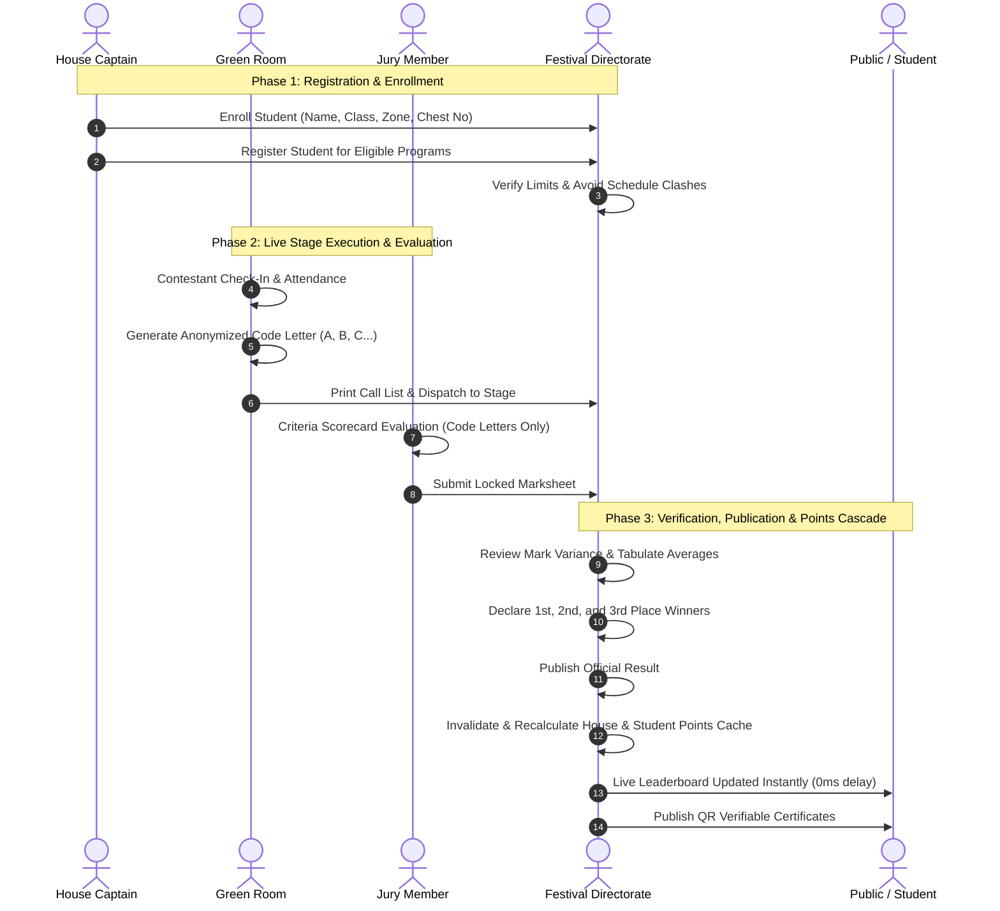

# QUAF Fest 09 — Festival Lifecycle & Operational Workflow
**End-to-End Operational Sequences from Setup to Grand Finale**

---

---

## Detailed Phase Breakdown

### Phase 1: Pre-Festival Preparations
1. **Academic House Configuration**: The 4 Houses (YUGO RUSHDIC, CONCO MAJDIC, LUMO FIKRIC, UNIO HILMIC) are initialized with unique codes and brand colors.
2. **Zone Mapping**: Competitions are created and locked into their eligible zone:
   - `A Zone`: Rabia & Thakhassus (TQS, S4)
   - `B Zone`: Salisa (S3)
   - `C Zone`: Oola & Sani (S1, S2)
   - `Mix Zone`: Open to all academic divisions
3. **Student Enrolment**: House captains register competitors, allocating unique chest numbers (e.g., `QF1001`).
4. **Program Registration**: Captains allocate students to individual and group competitions while adhering to participant limits (e.g., maximum 2 individual competitors per team).

---

### Phase 2: Live Conclave Execution
1. **Green Room Check-In**: Volunteers mark contestant presence on the stage roster.
2. **Anonymization**: The system assigns random code letters (`A`, `B`, `C`, `D`). Contestant names, houses, and chest numbers are masked to guarantee impartial evaluation.
3. **Stage Call**: Contestants are sequenced using printed Call Lists and verified via Chest Slips.
4. **Digital Evaluation**: Judges access the touch-optimized `/judge` portal on tablets or phones. They enter numeric marks across established scoring criteria (e.g., Presentation, Technique, Time).
5. **Submission Lock**: Once submitted, marks are cryptographically locked against further changes.

---

### Phase 3: Result Verification & Points Cascade
1. **Mark Tabulation**: Central Admin reviews submitted mark sheets and checks variance between multiple judges.
2. **Result Declaration**: Admin confirms 1st, 2nd, and 3rd place podium placements.
3. **Official Publication**:
   - Status transitions to `published`.
   - The points calculation engine awards:
     - 1st Place: 5 Points (or weighted equivalent)
     - 2nd Place: 3 Points
     - 3rd Place: 1 Point
   - `students.points_cache` increments immediately.
   - `groups.points_cache` recalculates aggregate house points.
   - `groups.rank_cache` sorts house championship rankings.
4. **Public Disclosure**: Results appear instantly on the public website homepage and results archive without requiring manual page refreshes.
5. **Certificate Issuance**: Digital certificates with scannable verification QR codes are generated for all winners and participants.
