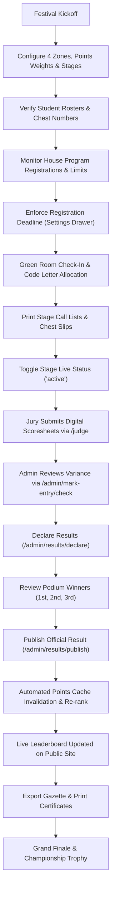

# QUAF Fest 09 — Central Administration Operational Flow
**Directorate Operations, Result Publication, and Event Orchestration**

---

---

## Operational Procedures

### 1. Pre-Festival Setup
1. **Initialize Academic Zones (`/admin/zones`)**:
   - Verify that programs are assigned to their designated zone (A Zone, B Zone, C Zone, Mix Zone).
   - Verify that participant limits are set correctly.
2. **Review Academic Houses (`/admin/groups`)**:
   - Verify that house names, codes, and captain accounts are linked.
3. **Student Roster Verification (`/admin/students`)**:
   - Verify chest numbers (format: `QF1001`, `QF1002`, etc.).
   - Verify that all students have a valid cryptographic QR token.

---

### 2. Stage Execution & Green Room Management
1. **Prepare Call Lists (`/admin/forms/call-list`)**:
   - Filter by stage venue and print the stage sequencing list.
2. **Anonymize Competitors (`/admin/code-letters`)**:
   - Execute one-click auto-assignment to allocate code letters (`A`, `B`, `C`...).
3. **Live Status Toggling (`/admin/stages`)**:
   - Set stage venue to `LIVE NOW` when proceedings commence; switch to `BREAK` during prayer or meal intervals.

---

### 3. Result Tabulation & Declaration
1. **Inspect Submitted Marksheets (`/admin/mark-entry/view-marks`)**:
   - Confirm that all assigned judges for the competition have submitted locked marks.
2. **Variance Check (`/admin/mark-entry/check`)**:
   - Inspect deviation across jury members to detect evaluation discrepancies.
3. **Declare Result (`/admin/results/declare`)**:
   - Confirm the computational 1st, 2nd, and 3rd place winners.
4. **Publish Result**:
   - Clicks **"Publish Result"**.
   - The system executes an atomic transaction updating `students.points_cache`, `groups.points_cache`, and `groups.rank_cache`.
   - The public website updates immediately with 0-second lag.
