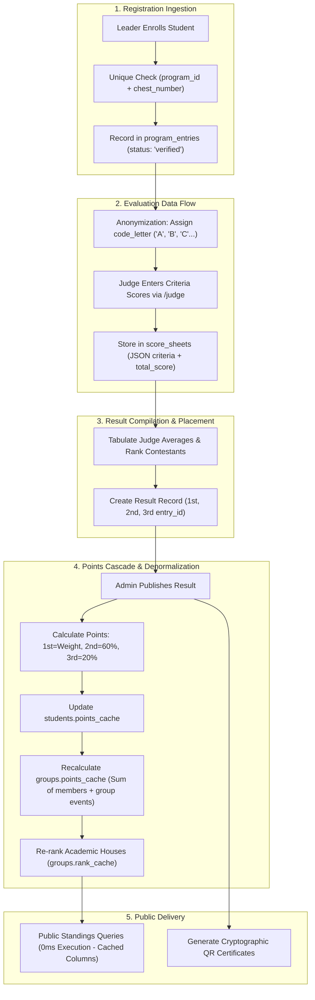

# QUAF Fest 09 — Data Flow & State Lifecycle
**Data Transformations, Calculations, and Cache Synchronization**

---



---

## Technical Details of Data Transformations

### 1. Scorecard Serialization
Judge criteria evaluations are serialized into `score_sheets.criteria_scores` as JSON:
```json
{
  "Pronunciation": 24.5,
  "Delivery & Body Language": 23.0,
  "Content & Relevance": 25.0,
  "Time Adherence": 10.0
}
```
The composite total score is saved as a precise decimal `score_sheets.total_score = 82.50`.

---

### 2. Points Engine Formula
When `AdminResultController@publish` triggers:
```php
$firstEntry = $result->firstEntry;
$secondEntry = $result->secondEntry;
$thirdEntry = $result->thirdEntry;

$weight = $program->points_weight ?: 5.0;

$p1 = $weight;
$p2 = (int) round($weight * 0.60);
$p3 = (int) round($weight * 0.20);

// Increment student individual cache
$firstEntry->student?->increment('points_cache', $p1);
$secondEntry?->student?->increment('points_cache', $p2);
$thirdEntry?->student?->increment('points_cache', $p3);

// Invalidate and recalculate group points
foreach (Group::all() as $group) {
    $total = Student::where('group_id', $group->id)->sum('points_cache');
    $group->update(['points_cache' => $total]);
}

// Re-rank academic houses
$ranked = Group::orderByDesc('points_cache')->get();
foreach ($ranked as $index => $group) {
    $group->update(['rank_cache' => $index + 1]);
}
```

This architecture ensures that high-volume public requests on `/` and `/results` never need to execute heavy aggregation queries (`SUM()` or `JOIN` operations across thousands of entries), yielding ultra-fast sub-5-millisecond response times.
