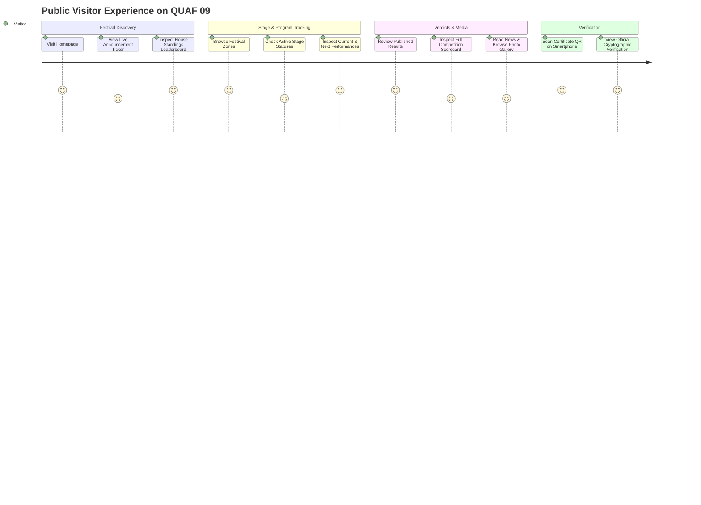

# QUAF Fest 09 — End-to-End User Experience & Journeys
**Public Audience and Student Competitor Interaction Flows**

---

## 1. Public Visitor Journey

### Steps:
1. **Landing on Portal (`/`)**:
   - The user sees the high-definition QUAF Season 09 title banner, official organizing tags, and real-time live alert ticker.
   - User reviews the 4 Academic Houses in real-time order of rank and live points.
2. **Exploring Academic Zones (`#zones`)**:
   - The user selects any of the 4 zones (A Zone, B Zone, C Zone, Mix Zone) to view which academic classes participate and see how many competitions are scheduled.
   - User clicks **"View Results"** to jump directly to verified results filtered for that zone.
3. **Tracking Active Stage Venues (`#stages`)**:
   - The user checks which stage is currently `LIVE NOW` or on `BREAK`.
   - The user reads the title of the currently performing item and the next up item.
4. **Inspecting Official Results (`/results`)**:
   - Filters results by program name, house, or stage.
   - Clicks into any result to see the 1st, 2nd, and 3rd place podium winners, chest numbers, and marks breakdown.
5. **Scanning Certificate QR Code (`/verify-certificate/{code}`)**:
   - Scans a physical printed certificate using a smartphone camera.
   - The browser opens the verification page confirming the student's name, chest number, event, placement, and official digital issuance timestamp.

---

## 2. Student Competitor Journey

1. **Accessing Student Dashboard (`/student`)**:
   - Competitor logs in using their email / chest ID credentials.
   - The dashboard displays their assigned house, academic zone, and accumulated individual points.
2. **Reviewing Event Schedule**:
   - Lists all events the student is enrolled in, showing schedule dates, stage venue locations, and participant limits.
3. **Digital Chest Slip**:
   - Displays a touch-friendly digital chest badge for presentation at the Green Room check-in desk.
4. **Certificate Collection**:
   - Once competition results are verified and published, students can download or view their verified digital certificates.
